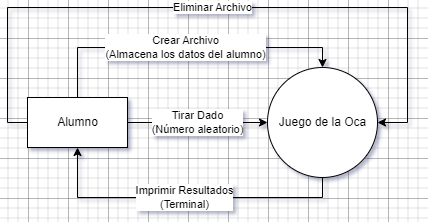
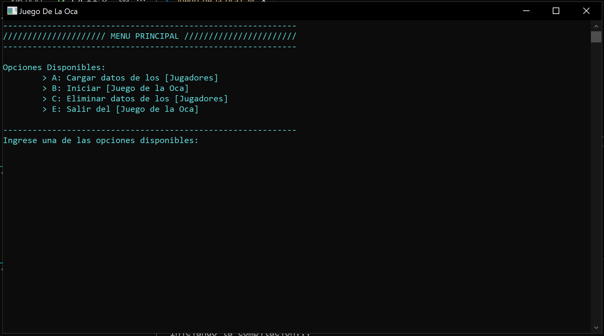

# Juego de la Oca

## Historia Del Proyecto

Este proyecto fue desarrollado durante el cursado de Algoritmo y Estructura II de la carrera de Ing. En Informática. En el Año 2018.

## Descripción

Juego de la Oca desarrollado en lenguaje C, sin interfaz gráfica.
Implementa estructuras de datos tales como; Árbol Binario, Lista Enlazada Doble, Cola.

## ¿Que es el juego de la Oca?

El Juego de la oca (en inglés “Game of the Goose”), es un juego de mesa donde 2 o más jugadores mueven sus fichas sobre un circuito tirando un dado. El tablero consiste en una pista con 63 casillas, organizadas en espiral. El objetivo del juego es llegar a la casilla número 63 (El jardín de la oca) antes que los otros jugadores, evitando obstáculos como el laberinto, la posada, el pozo, la cárcel o la muerte, y aprovechando las casillas en las que se representa una oca, que permiten al jugador adelantar una cierta distancia y lanzar los dados otra vez.

[Para mas información, presione este texto.](https://www.guiaspracticas.com/juegos-de-mesa/juego-de-la-oca)

## Diagrama de Contexto

## Vista Previa

## Advertencia

* Si usted desea cargar mas jugadores, primero deberá eliminar el archivo.dat existente.

## Compilador

* [MinGW](https://www.mingw-w64.org/)

## Version

**c11**

## Construido con 🛠️

- Lenguaje **C**

## Autor ✒️

- **Usui, José Fernando** - _Diseño y Desarrollo del Sistema_

## Contacto 📱

- Gmail: _joesesilvae@gmail.com_
